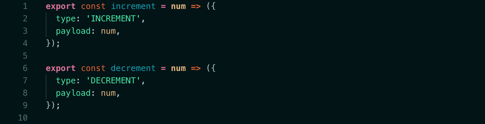

# **Code Explained**

Here's a simple implementation of Redux where we use it to manage the state  of a counter (integer). I've used `npx create-react-app` to spin this project up, so we're looking at Redux within the context of a React project, although Redux itself is agnostic and can be used in conjunction with plain JavaScript or any JavaScript framework or library.

**Actions** are plain JavaScript objects which send data from the application to the store (global state). We send actions to our store using `store.dispatch()`. Here are example actions which represent adding or subtracting from a counter. When an action is held in a function, this is called an **action creator**.

To initiate our dispatch we need to pass the result to Redux' `dispatch()` function.